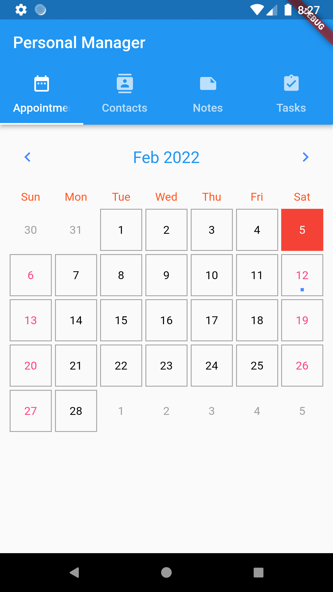
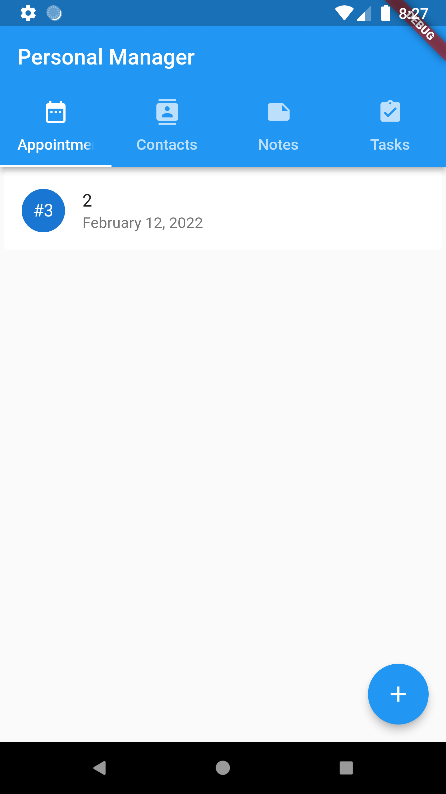
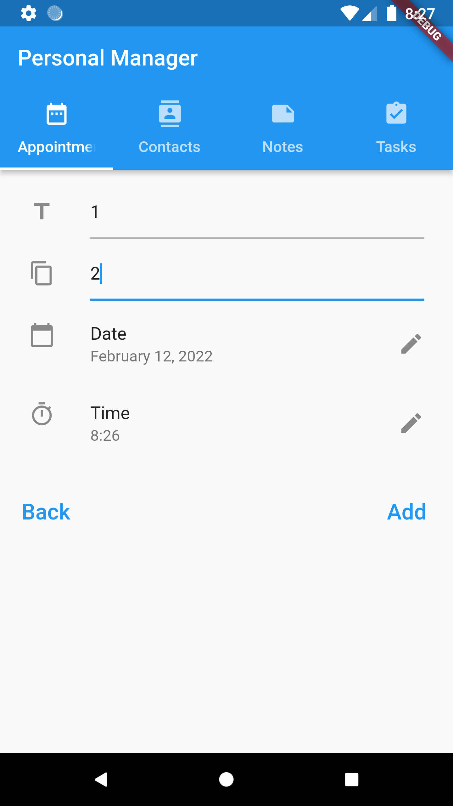
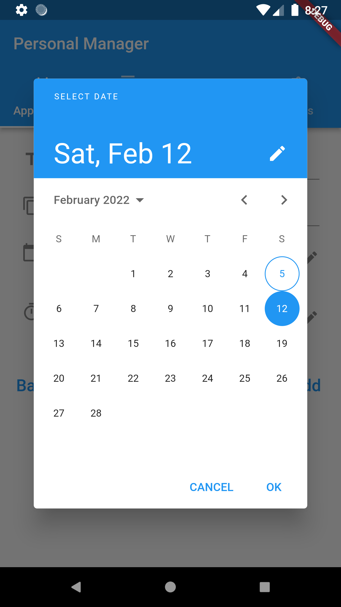
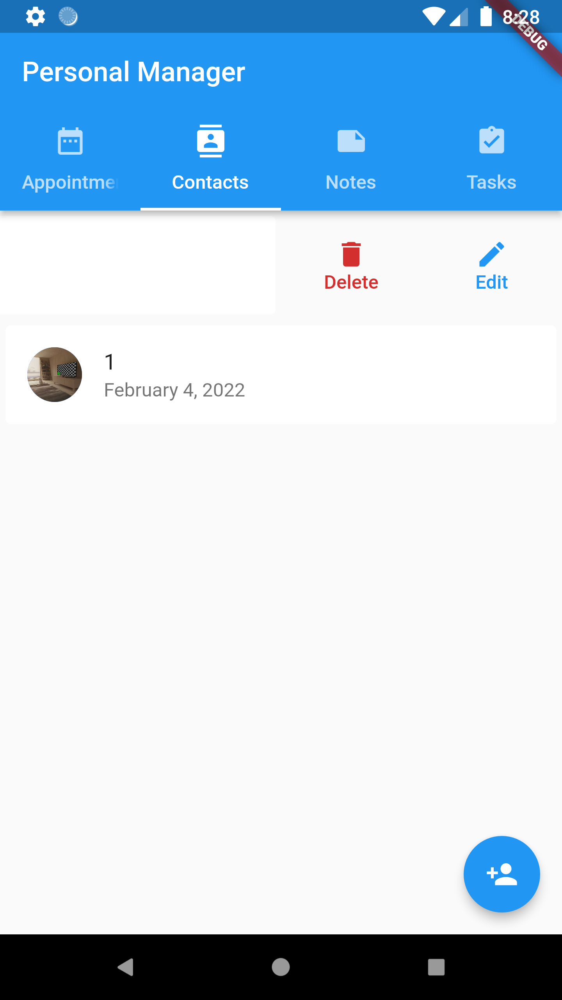
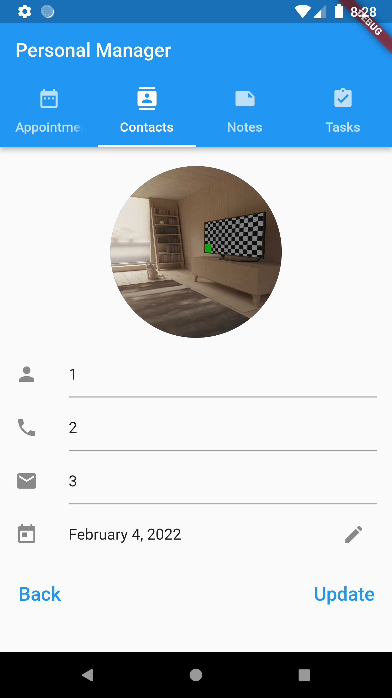
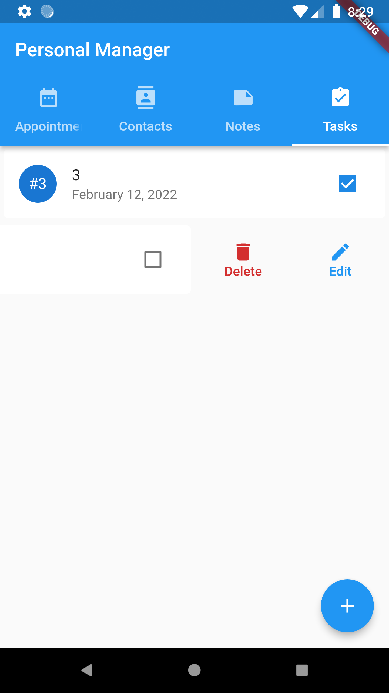
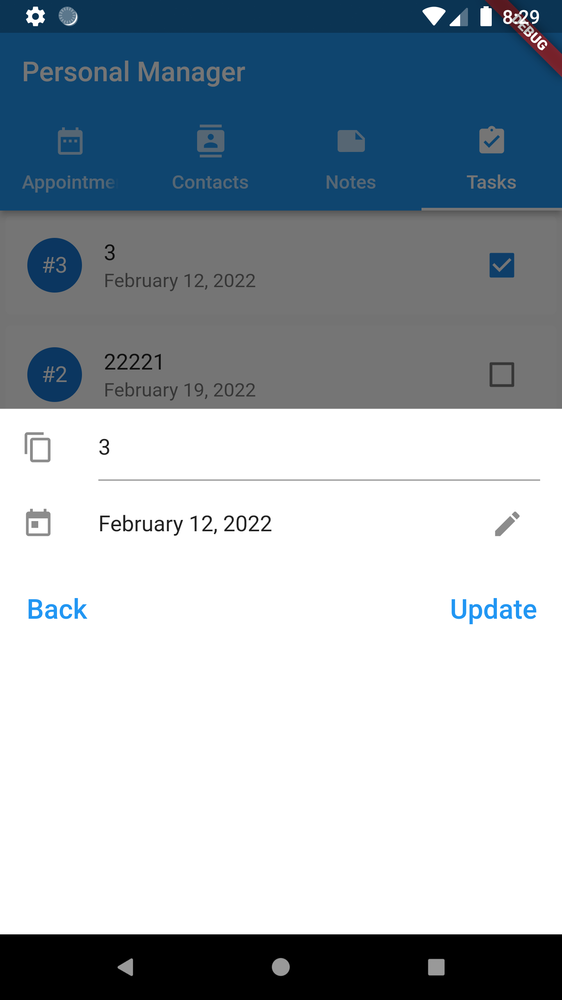

# Personal Manager

A simple local Personal Manager App as app what i maked when learn Flutter by book "Flutter in Action".

## Stack and Libraries

- State Manager: getX
- DB: sqflite
- ImagePicker

## Features

- CRUD with entity (Task, Contact, Notes, Appointments) in local db;
- Pick date and time of day;
- Used GetX for state management.

## Screenshots

| Appointments screen | Appointments picked of date | Appointment add data |
| - | - | - |
|  |  |  |

| Appointment, add data: pick time | Appointments, add data: pick date | Contacts screen |
| - | - | - |
|  |  |  |

| Contact added data with picked image |  Notes screen | Note added data |
| - | - | - |
|  |  |  |

| Task screen | Task modal bottom sheet add data |
| - | - |
|  |   |

## Author

S.D.V.