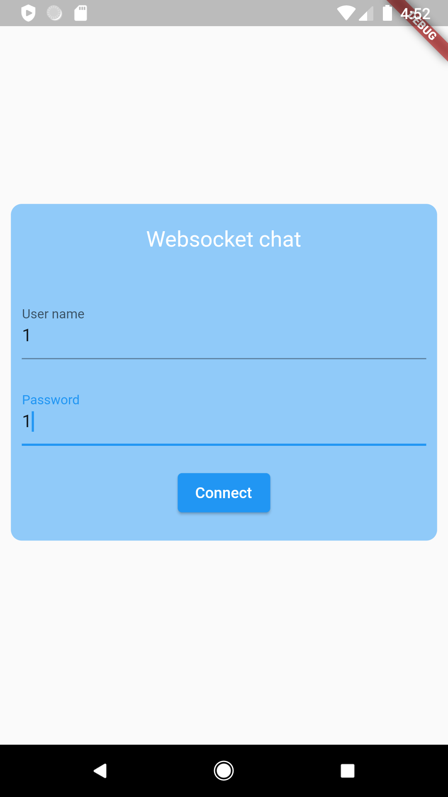
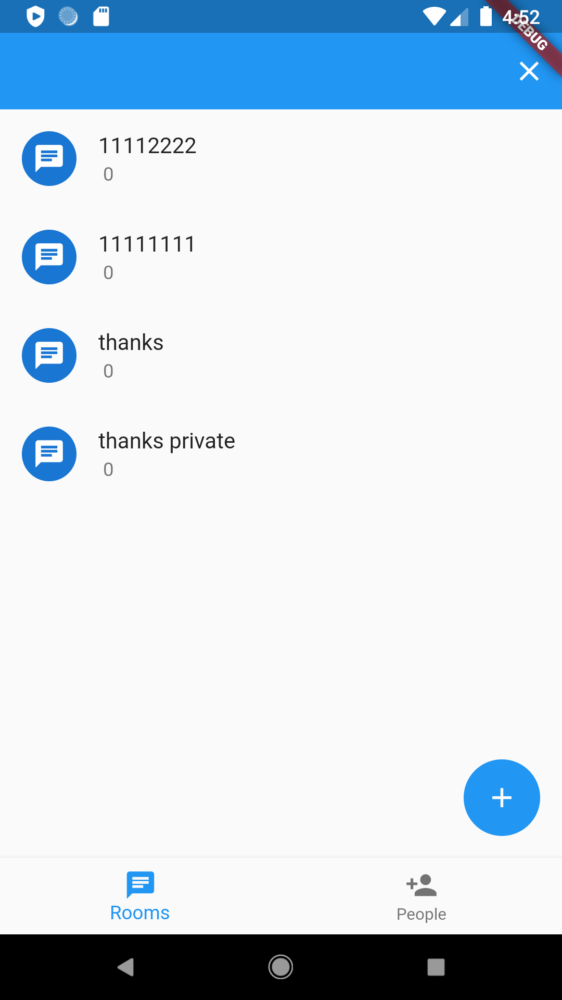
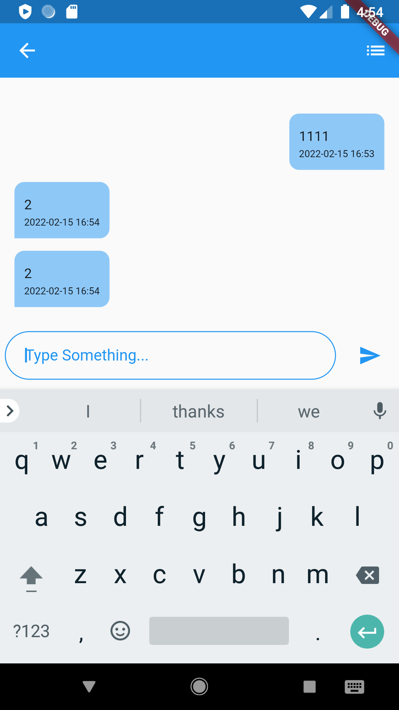
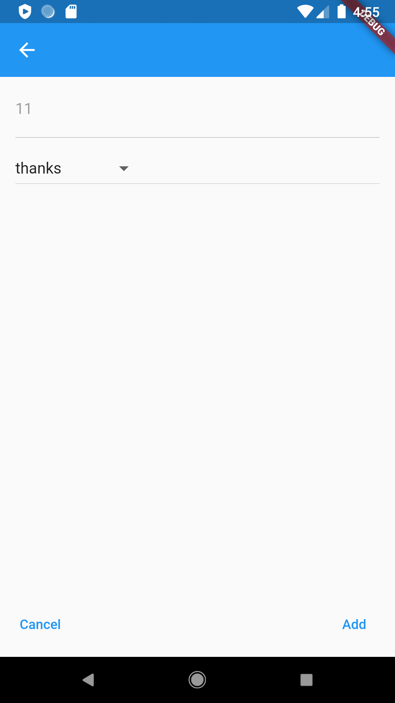
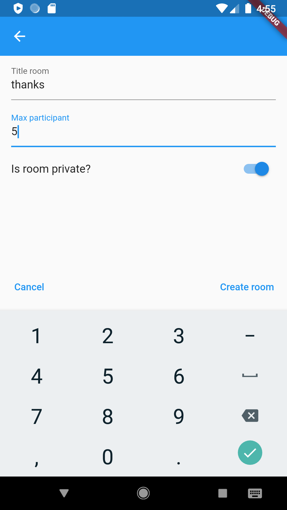

# Socket.io (Node.js) and Flutter app

A small application for creating a chat using websockets, Flutter, Node.js and Getx.
In the application, I used Getx: GetService, GetController, Bindings, Routing and Middleware.

## Attention

My goal was to use websocket technology in combination with the Getx state manager, so you will not find good design and other interesting solutions here.

## Features
### Realized features

- [x] Realtime update data in the app;
- [x] Simple Sign In and Sign Up;
- [x] Create Room: Title, set max participants, private or public;
- [x] Invite user when user has created his own Rooms;
- [x] Notification in App: invite, new uwer connect to Room;
- [x] Check Participants in Room.

## Screenshots

| Sign Up and Sign In screen | Home screen (Rooms) screen | Home screen (People) screen |
| - | - | - |
|  |  |  |

| Room screen with menu | Participants screen | Room screen with message another participant |
| - | - | - |
|  |  |  |

| Add user to room | Create new Room | 
| - | - | - |
|  |  | 

## Configuration
I developed this app with [Socket.IO](https://socket.io/) on Backend (Node.js) and Frontend app.

## Author
Danil Shubin, 2022

## License
MIT
