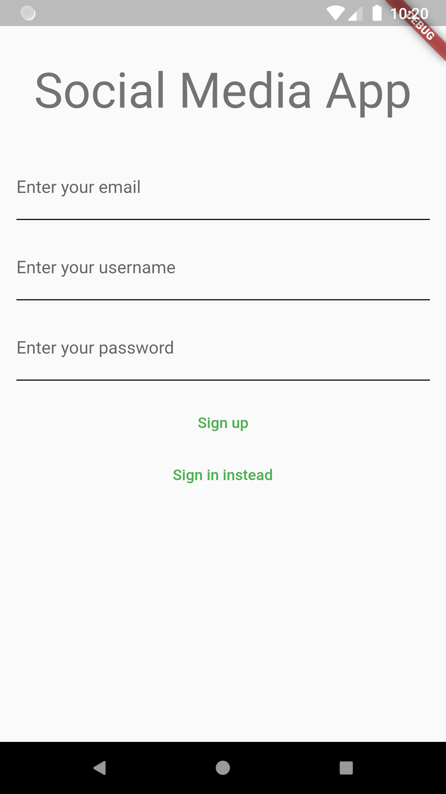
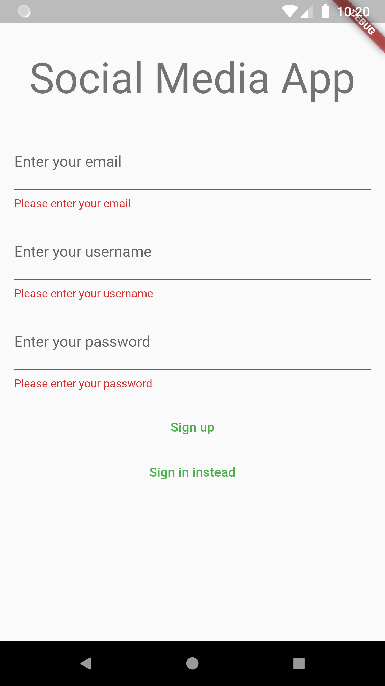
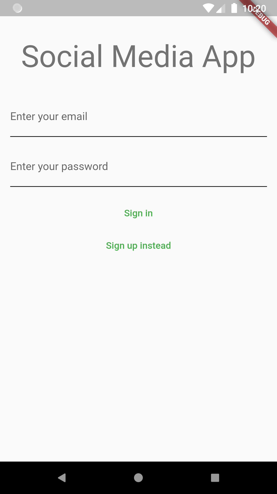
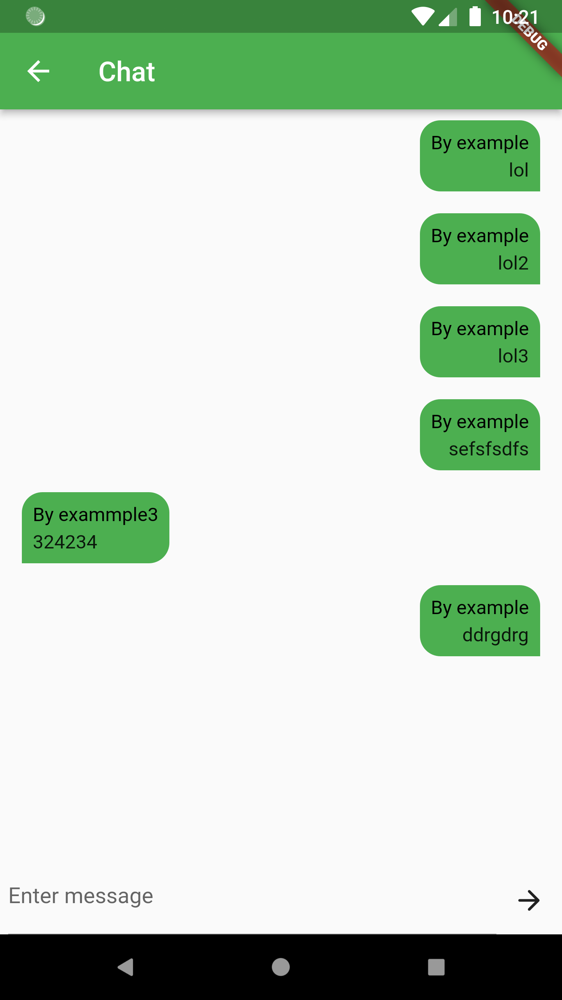
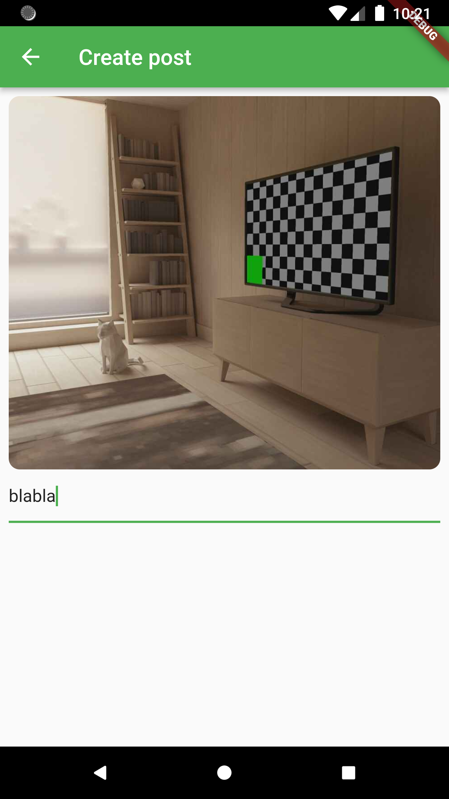

# social_app

A small project to create a messenger with posts.

## How install project
1. Sign up in [sentry](https://sentry.io/) and create project, add created url in .env file (root project) with variable name "SENTRY_API_KEY";
2. Compile app.

## In project used

- BLOC;
- Firebase auth;
- Firebase cloud firestore;
- Firebase storage;
- Sentry.

## Features app

- [x] Named routing;
- [x] Validation data in fields;
- [x] Used pattern BLOC;
- [x] Used crashlytics with [sentry](https://sentry.io/);
- [x] Firebase auth with email and password - sign in, sign up, sign out;
- [x] Firebase cloud firestore - CRUD. Collections: users, posts, comments in posts;
- [x] Firebase storage - data storage for image.

## Screenshots

| Sign up | Sign up (validation) | Sign in |
|--|--|--|
| |  |  |

| Posts | Post comments | Post add |
|--|--|--|
| |  |  |
